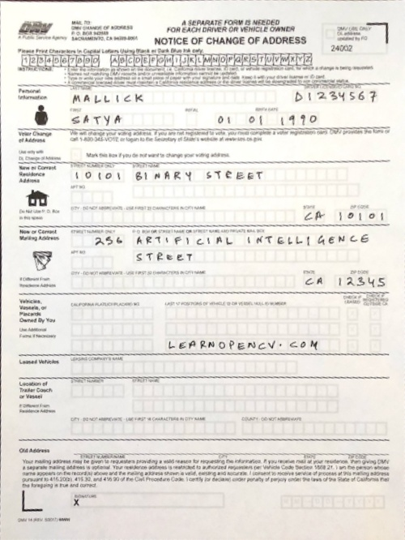

# Document Scanner using OpenCV

This project implements a **Document Scanner** application using Python and OpenCV. The scanner performs foreground-background segmentation using the GrabCut algorithm and applies perspective transformation to generate a corrected, high-quality output of the scanned document. The application is interactive, allowing users to mark regions using mouse input for precise scanning.

## Features

- **Interactive Region Selection:** Users can draw a rectangle around the document and refine the selection using mouse events.
- **Foreground-Background Segmentation:** Utilizes the GrabCut algorithm for isolating the document from the background.
- **Contour Detection and Approximation:** Extracts contours and approximates them to identify the four corner points of the document.
- **Perspective Transformation:** Warps the document into a rectangular, top-down view for output.
- **Dynamic Output Resizing:** Ensures the output image has a consistent width of 500 pixels while maintaining aspect ratio.
- **User-Friendly Controls:** Keyboard shortcuts for resetting, saving, and refining the segmentation.

## How It Works

1. **Load the Image:** The application loads an image either specified by the user or a default placeholder image.
2. **Mark the Document:** The user draws a rectangle around the document using the mouse.
3. **Refine the Selection:** Keyboard shortcuts enable fine adjustments to foreground and background regions.
4. **Process the Image:** The application detects contours, approximates a polygon, and performs perspective transformation.
5. **Save the Output:** The final scanned document is displayed and can be saved to the disk.

## Installation

1. Clone the repository:
   ```bash
   git clone https://github.com/yourusername/document_scanner
   cd document_scanner
   ```
2. Install the required dependencies:
   ```bash
   pip install opencv-python numpy
   ```

## Usage

Run the application with the following command:
```bash
python document_scanner.py 
```

### Controls
- `Left Mouse Button`: Mark regions (draw rectangle or touch-ups).
- `0`: Mark background regions.
- `1`: Mark foreground regions.
- `2`: Mark probable background regions.
- `3`: Mark probable foreground regions.
- `n`: Process the image and refine segmentation.
- `r`: Reset all selections.
- `s`: Save the output image.
- `ESC`: Exit the application.

## Project Details

- **Language:** Python
- **Libraries Used:** OpenCV, NumPy
- **Algorithm:** GrabCut for segmentation, Contour approximation for corner detection, Perspective Transformation for warping

## Output Example

The scanned document is transformed into a rectangular, top-down view:

- **Input Image:**


- **Output Image:**



## Contributing

Contributions are welcome! If you find a bug or have a suggestion, feel free to open an issue or submit a pull request.


